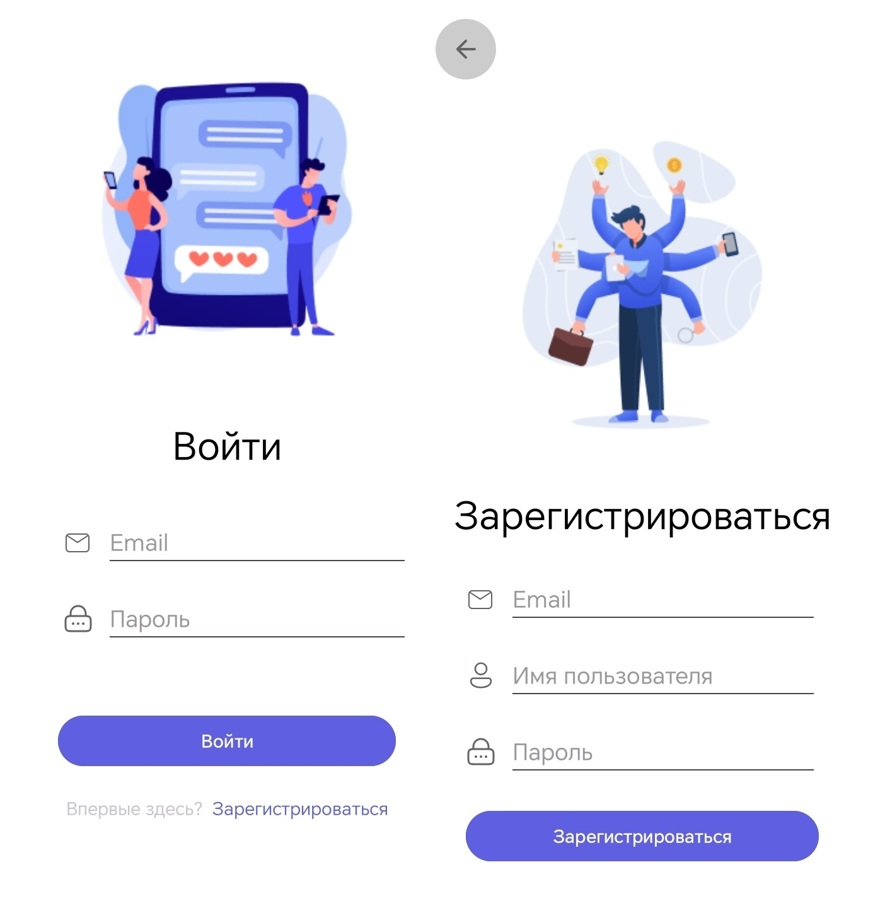
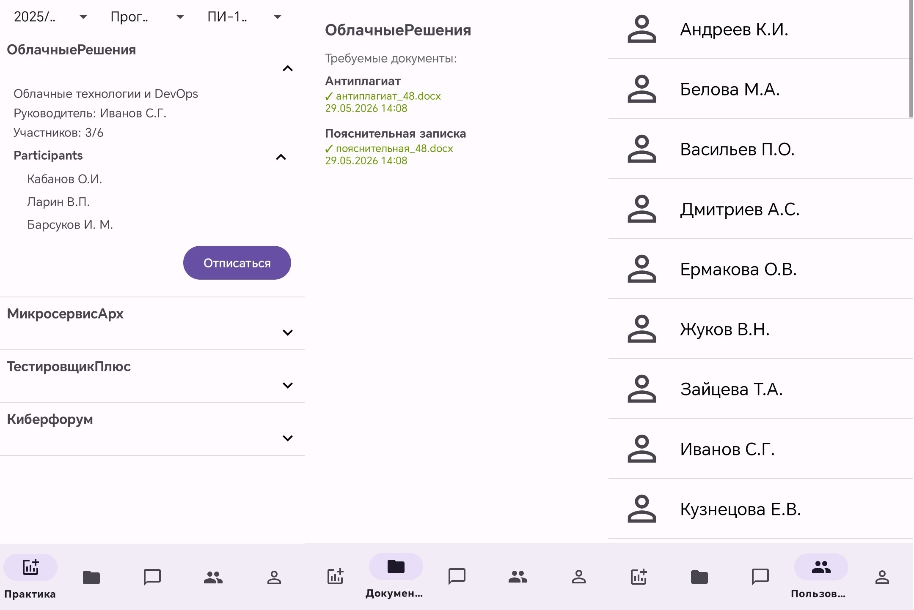
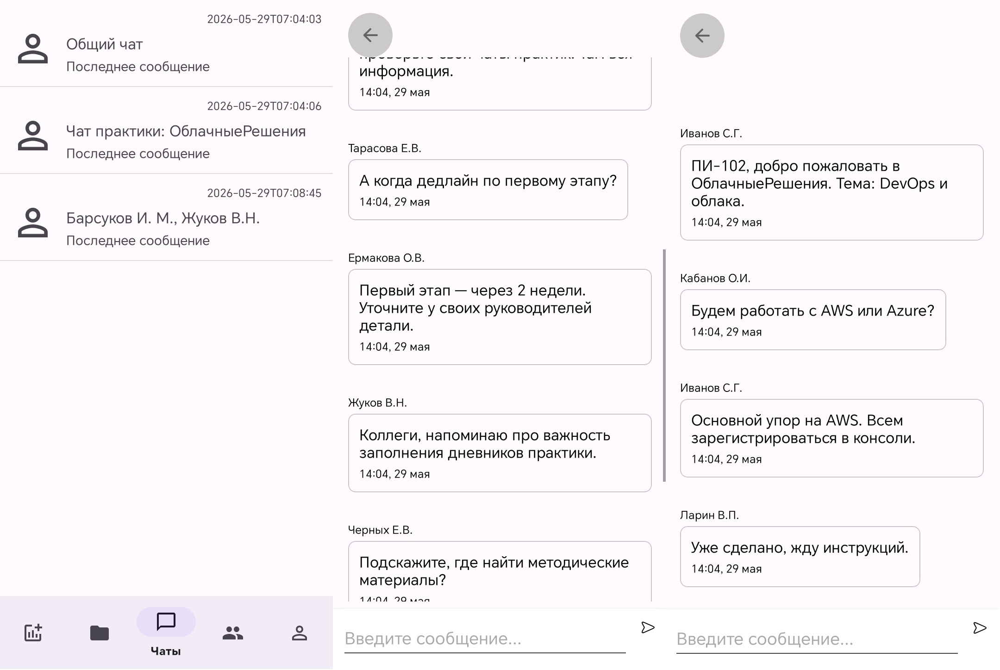

# Prac-Link · Practice Management

   

A mobile app and REST API for managing industrial practice: choosing practice placements, uploading documents, and chatting between students and supervisors.

---

## ⚙️ Features

| Module | Description |
|--------|-------------|
| **Authentication** | Registration and login via email and password |
| **Practice** | Filter by year, course, and group; enroll in a practice placement |
| **Documents** | Upload and track required file submissions |
| **Chats** | General chat, practice chat, and private conversations |
| **Users** | Participant list and new dialog creation |

---

## 📸 Screenshots

### Login and registration

  

### Main app sections

  

### Chats

  

---

## 📋 Requirements

| Component | Version |
|-----------|---------|
| Python | 3.13+ |
| Poetry | 2.x |
| Docker / Docker Compose | Latest |
| Android Studio | Latest |
| JDK | 17 |
| Gradle | 8.x (wrapper in `client/`) |

---

# 📄 License

MIT — see [LICENSE](LICENSE).

---

**© 2026 Star-Barsuk**

